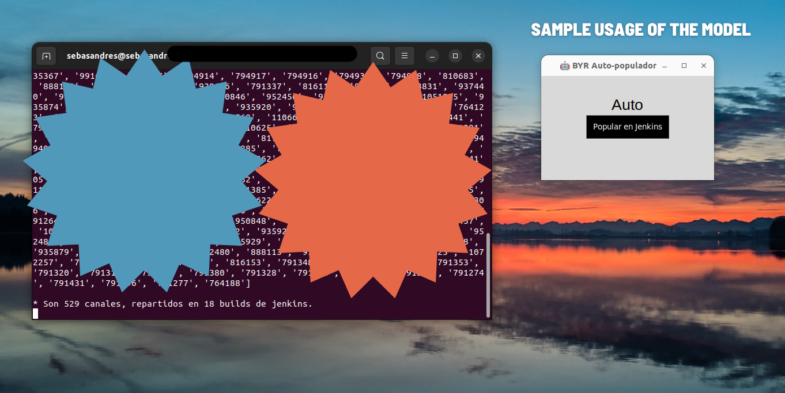

# Elastic-to-Jenkins 🤖 (1.0.0)
Este programa lee contenidos de un Elasticsearch, dada una query y host, e invoca builds de un job de Jenkins con ellos. 
Provee una interfaz grafica que facilita la carga de contenido con poca configuracion y código.

 

RECORDATORIO: Puede que necesites estar conectado a una VPN para ejecutarlo 🌎.

### Configuración básica.

> Linux (w/ Python) 🧑‍💻👩‍💻
> - Clonar el repositorio.
> - Configura Jenkins desde el nodo homonimo en configs/config.json.
> - Configura el host de elastic-search (nodo ELASTICSEARCH) en configs/config.json.
> - Configura este programa desd el nodo PROGRAM. Establecer "run":1.
> - Determinar la query para elastic-search en el archivo configs/es-query.json.
> - Ejecutar en la consola "python3 main.py"

> Windows 🕵🕵️‍♀️
> - Visitar el siguiente <a href="https://drive.google.com/drive/"> enlace </a> y descargar el .zip de tu versión correspondiente.
> - Configura Jenkins desde el nodo homónimo en configs/config.json.
> - Configura el host de elastic-search (nodo ELASTICSEARCH) en configs/config.json.
> - Configura este programa desd el nodo PROGRAM. Establecer "run":1.
> - Determinar la query para elastic-search en el archivo configs/es-query.json.
> - Ejecutar el archivo main.exe

### Información adicional:
Dentro de configs/config.json:
> Node PROGRAM: 
> * logs=1 <=> verbose=True
> * run=0 -> se simula el build. 

